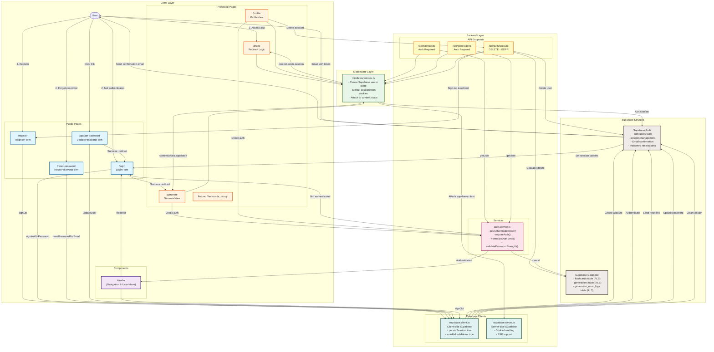
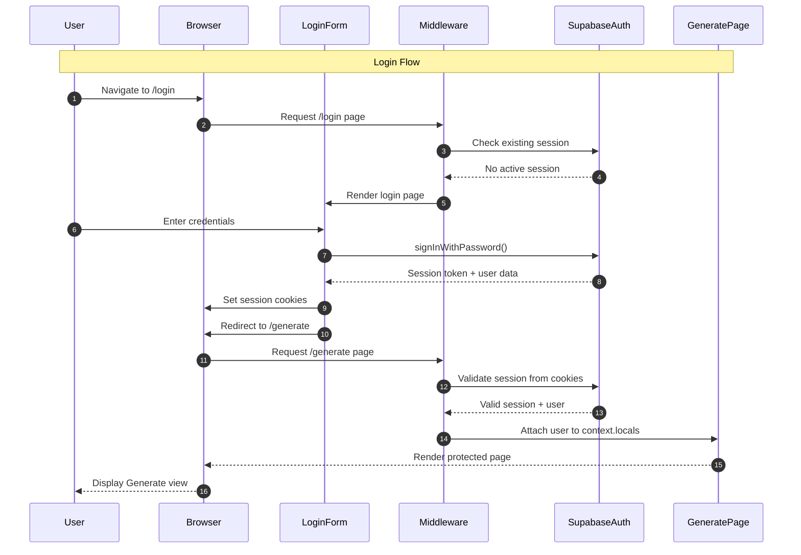
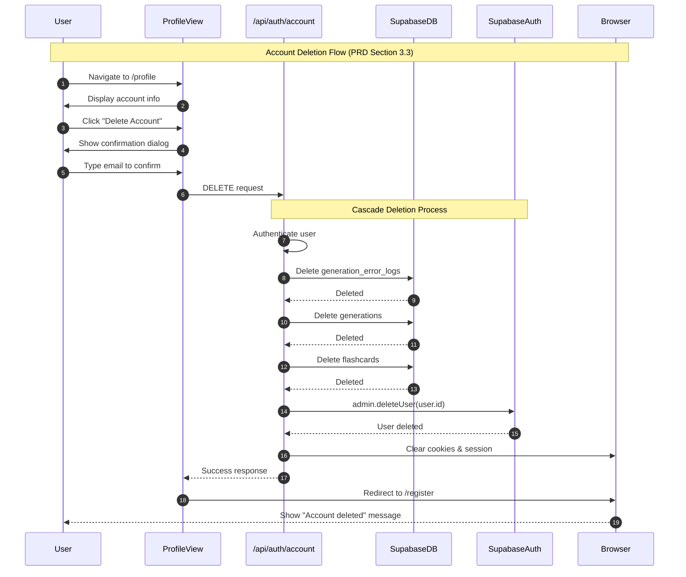
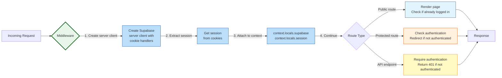
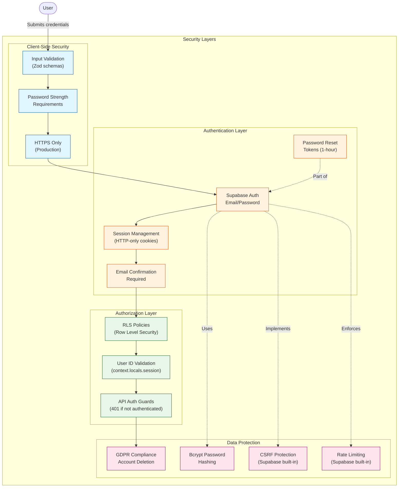

# Authentication System Architecture Diagram

## Main Authentication Flow Diagram

## Component Interaction Diagram

## Account Deletion Flow

## Middleware Request Flow

## File Structure Overview

```mermaid
graph TB
    subgraph "New Files to Create"
        NP1["src/pages/login.astro"]
        NP2["src/pages/register.astro"]
        NP3["src/pages/reset-password.astro"]
        NP4["src/pages/update-password.astro"]
        NP5["src/pages/profile.astro"]

        NC1["src/components/LoginForm.tsx"]
        NC2["src/components/RegisterForm.tsx"]
        NC3["src/components/ResetPasswordForm.tsx"]
        NC4["src/components/UpdatePasswordForm.tsx"]
        NC5["src/components/Header.tsx"]
        NC6["src/components/ProfileView.tsx"]

        NA1["src/pages/api/auth/account.ts"]

        NS1["src/lib/services/auth.service.ts"]
        NS2["src/db/supabase.server.ts"]
    end

    subgraph "Files to Modify"
        MP1["src/middleware/index.ts"]
        MP2["src/pages/index.astro"]
        MP3["src/pages/generate.astro"]
        MP4["src/layouts/Layout.astro"]

        MD1["src/db/supabase.client.ts"]

        MA1["src/pages/api/flashcards.ts"]
        MA2["src/pages/api/generations.ts"]

        MT1["src/types.ts"]
        MT2["src/env.d.ts"]
    end

    subgraph "Existing Components (Reuse)"
        EC1["src/components/ui/input.tsx"]
        EC2["src/components/ui/button.tsx"]
        EC3["src/components/ui/card.tsx"]
        EC4["src/components/ui/alert.tsx"]
        EC5["src/components/ErrorMessage.tsx"]
        EC6["src/components/SuccessMessage.tsx"]
    end

    NP1 -.->|uses| NC1
    NP2 -.->|uses| NC2
    NP3 -.->|uses| NC3
    NP4 -.->|uses| NC4
    NP5 -.->|uses| NC6

    NC1 -.->|uses| EC1
    NC1 -.->|uses| EC2
    NC1 -.->|uses| EC3
    NC2 -.->|uses| EC1
    NC2 -.->|uses| EC2
    NC6 -.->|uses| EC4

    MP1 -.->|uses| NS2
    MP3 -.->|uses| NC5

    NC1 -.->|calls| MD1
    NC2 -.->|calls| MD1
    NC6 -.->|calls| NA1

    MA1 -.->|uses| NS1
    MA2 -.->|uses| NS1
    NA1 -.->|uses| NS1

    style NP1 fill:#e1f5ff,stroke:#01579b
    style NP2 fill:#e1f5ff,stroke:#01579b
    style NP3 fill:#e1f5ff,stroke:#01579b
    style NP4 fill:#e1f5ff,stroke:#01579b
    style NP5 fill:#fff3e0,stroke:#e65100

    style NC1 fill:#f3e5f5,stroke:#4a148c
    style NC2 fill:#f3e5f5,stroke:#4a148c
    style NC3 fill:#f3e5f5,stroke:#4a148c
    style NC4 fill:#f3e5f5,stroke:#4a148c
    style NC5 fill:#f3e5f5,stroke:#4a148c
    style NC6 fill:#f3e5f5,stroke:#4a148c

    style NA1 fill:#fff9c4,stroke:#f57f17
    style NS1 fill:#fce4ec,stroke:#880e4f
    style NS2 fill:#e0f2f1,stroke:#004d40

    style MP1 fill:#ffe0b2,stroke:#e65100
    style MP2 fill:#ffe0b2,stroke:#e65100
    style MP3 fill:#ffe0b2,stroke:#e65100
```

## Security & Data Flow

